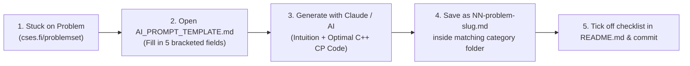

# ⚡ CSES Problem Set Solutions (C++)

> Companion to the renowned [CSES Problem Set](https://cses.fi/problemset/) by Antti Laaksonen  
> **400 Problems across 18 Categories** — Solved in modern C++ (C++17/C++20) with Fast I/O, mathematical complexity derivations, state-transition traces, overflow analysis, and competitive programming follow-up Q&A.

---

## 📚 Curriculum Breakdown

| # | Category Folder | Core Topics & Techniques Covered | Problem Count | Status |
|---|---|---|:---:|:---:|
| 01 | [**01-Introductory-Problems**](./01-Introductory-Problems/README.md) | Simulation, Bit Manipulation, Recursion, Number Theory Basics, Constructive Math | **24** | 🟢 Completed (24/24) |
| 02 | [**02-Sorting-and-Searching**](./02-Sorting-and-Searching/README.md) | Binary Search on Answer, Two Pointers, Sweep-line, Coordinate Compression, Greedy | **35** | ⚪ Scaffolding Ready |
| 03 | [**03-Dynamic-Programming**](./03-Dynamic-Programming/README.md) | 1D/2D DP, Coin Change, Knapsack, LIS $\mathcal{O}(n \log n)$, Grid Paths, Digit DP, Bitmask DP | **23** | ⚪ Scaffolding Ready |
| 04 | [**04-Graph-Algorithms**](./04-Graph-Algorithms/README.md) | BFS/DFS, Dijkstra, Bellman-Ford, Floyd-Warshall, Kruskal (DSU), Kahn's Topo, Tarjan SCC | **36** | ⚪ Scaffolding Ready |
| 05 | [**05-Range-Queries**](./05-Range-Queries/README.md) | Static Range Queries, Fenwick Tree (BIT), Segment Tree (Point/Range Updates), Lazy Propagation | **25** | ⚪ Scaffolding Ready |
| 06 | [**06-Tree-Algorithms**](./06-Tree-Algorithms/README.md) | Tree Traversals, Subtree Sizes, Tree Diameter, Binary Lifting (LCA), Centroid Decomposition | **16** | ⚪ Scaffolding Ready |
| 07 | [**07-Mathematics**](./07-Mathematics/README.md) | Exponentiation, Modular Inverse, Extended Euclidean, Matrix Exponentiation, Combinatorics, Primes | **37** | ⚪ Scaffolding Ready |
| 08 | [**08-String-Algorithms**](./08-String-Algorithms/README.md) | Polynomial String Hashing, Trie, KMP (Prefix Function), Z-Algorithm, Aho-Corasick | **21** | ⚪ Scaffolding Ready |
| 09 | [**09-Geometry**](./09-Geometry/README.md) | Cross/Dot Product, Point Orientation, Line Segment Intersection, Polygon Area, Convex Hull | **16** | ⚪ Scaffolding Ready |
| 10 | [**10-Advanced-Techniques**](./10-Advanced-Techniques/README.md) | Meet in the Middle, Heavy-Light Decomposition (HLD), Mo's Algorithm, Treap, Fast Fourier Transform | **25** | ⚪ Scaffolding Ready |
| 11 | [**11-Sliding-Window-Problems**](./11-Sliding-Window-Problems/README.md) | Monotonic Deque, Sliding Window Minimum/Maximum, Variable Sized Windows, Median in Window | **11** | ⚪ Scaffolding Ready |
| 12 | [**12-Interactive-Problems**](./12-Interactive-Problems/README.md) | Interactive Binary Search, Query Minimization, Feedback Adaptation, Stream Flushing | **6** | ⚪ Scaffolding Ready |
| 13 | [**13-Bitwise-Operations**](./13-Bitwise-Operations/README.md) | Bitwise AND/OR/XOR Algebra, SOS DP (Sum Over Subsets), Gray Codes, Bitwise Bases | **11** | ⚪ Scaffolding Ready |
| 14 | [**14-Construction-Problems**](./14-Construction-Problems/README.md) | Invariant Constructions, Parity Balancing, Permutation Routing, Grid Coloring | **8** | ⚪ Scaffolding Ready |
| 15 | [**15-Advanced-Graph-Problems**](./15-Advanced-Graph-Problems/README.md) | Dinic's Max Flow, Hopcroft-Karp Bipartite Matching, Min Cut, Euler Tours, 2-SAT | **28** | ⚪ Scaffolding Ready |
| 16 | [**16-Counting-Problems**](./16-Counting-Problems/README.md) | Inclusion-Exclusion Principle, Burnside's Lemma, Stirling Numbers, Cayley's Formula | **18** | ⚪ Scaffolding Ready |
| 17 | [**17-Additional-Problems-I**](./17-Additional-Problems-I/README.md) | Advanced Dynamic Programming, Square Root Decompositions, Ad-Hoc Combinatorics | **30** | ⚪ Scaffolding Ready |
| 18 | [**18-Additional-Problems-II**](./18-Additional-Problems-II/README.md) | Research-Level Competitive Programming Challenges, Hybrid Segment Trees, Advanced Math | **30** | ⚪ Scaffolding Ready |
| **Total** | | **Complete CSES Problem Set** | **400** 🏆 | |

---

## 🎯 How to Use This Track When You're Stuck



1. **Open the problem** on [CSES Problem Set](https://cses.fi/problemset/).
2. **Open [`AI_PROMPT_TEMPLATE.md`](./AI_PROMPT_TEMPLATE.md)**, copy the fenced prompt block, and fill in the 5 fields (*Name, Category, CSES Task ID & Link, Limits, Statement & Constraints*).
3. **Paste into Claude / AI** to get the standardized 10-part competitive programming note:
   - 1. Problem, Restated
   - 2. Intuition & Pattern Recognition
   - 3. Approach 1 — Naive / Brute Force (or Simplest Baseline)
   - 4. Approach 2 — Intermediate / Better
   - 5. Approach 3 — Optimal CSES Solution (with derived Time/Space Complexity)
   - 6. Correctness Proof (Invariants, Exchange Arguments, Termination)
   - 7. Dry Run & Visual State Trace
   - 8. Edge Cases, Overflow Gotchas & CSES Constraints
   - 9. Competitive Programming & Interview Follow-Up Questions
   - 10. Tags, Complexity Summary & Related CSES Problems
4. **Save the response** as `NN-problem-slug.md` in the appropriate category folder.
5. Review [`EXAMPLE_Weird_Algorithm.md`](./EXAMPLE_Weird_Algorithm.md) for the benchmark quality standard.

---

## ⚡ Competitive Programming C++ Standards

Every solution in this repository adheres to modern, strict competitive programming standards:

### 1. Fast I/O Template
Standard C++ streams synchronize with C stdio and flush on buffer reads by default. For $N \ge 2 \cdot 10^5$, Fast I/O is mandatory to prevent TLE:
```cpp
#include <iostream>

using namespace std;

int main() {
    ios_base::sync_with_stdio(false);
    cin.tie(nullptr);
    // Use '\n' instead of endl to avoid redundant stream flushes
}
```

### 2. 64-bit Integer Overflow Safety
CSES test cases deliberately check for integer overflow. Array elements up to $10^9$ summed over $N = 2 \cdot 10^5$ require $2 \cdot 10^{14}$, well past $2^{31} - 1 \approx 2.14 \times 10^9$.
- Use `long long` for prefix sums, accumulated products, and coordinate distances.
- Avoid implicit truncation: use `1LL * a * b` when multiplying 32-bit integers.

### 3. Policy-Based Data Structures (PBDS)
For order-statistics queries (finding the $k$-th smallest element or counting elements strictly less than $x$ in $\mathcal{O}(\log N)$), GNU C++ PBDS is utilized:
```cpp
#include <ext/pb_ds/assoc_container.hpp>
#include <ext/pb_ds/tree_policy.hpp>

using namespace std;
using namespace __gnu_pbds;

template <typename T>
using ordered_set = tree<T, null_type, less<T>, rb_tree_tag, tree_order_statistics_node_update>;
```

### 4. Anti-Hack Custom Hash for `unordered_map`
To prevent worst-case $\mathcal{O}(N^2)$ attacks on CSES tests caused by hash collision exploits:
```cpp
#include <chrono>
#include <unordered_map>

using namespace std;

struct custom_hash {
    static uint64_t splitmix64(uint64_t x) {
        x += 0x9e3779b97f4a7c15;
        x = (x ^ (x >> 30)) * 0xbf58476d1ce4e5b9;
        x = (x ^ (x >> 27)) * 0x94d049bb133111eb;
        return x ^ (x >> 31);
    }
    size_t operator()(uint64_t x) const {
        static const uint64_t FIXED_RANDOM = chrono::steady_clock::now().time_since_epoch().count();
        return splitmix64(x + FIXED_RANDOM);
    }
};
// Usage: unordered_map<long long, int, custom_hash> safe_map;
```

---

## 🛠️ Automated Setup & Scaffolding

To scaffold or verify all 18 category folders and checklists:
```bash
chmod +x setup_structure.sh
./setup_structure.sh
```

---

**Happy Problem Solving! 🚀**
